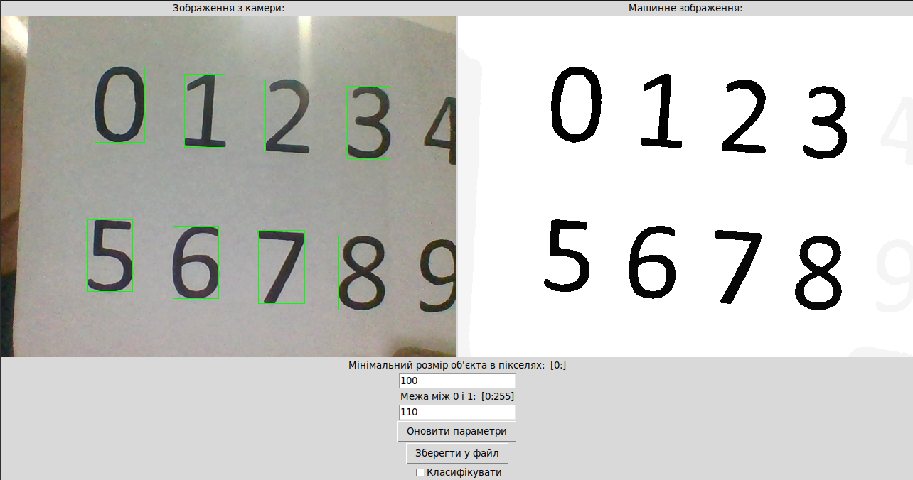

1. Зчитувати зображення з камери
2. Бінаризувати зображення (зробити чорно-білим за певним алгоритмом)
3. Прибрати чорні об'єкти які торкаються країв зображення
4. Прибрати малі об'єкти, розмір яких менший за певну кількість пікселів
5. Пронуменувати кожен об'єкт

Для кожного об'єкту:
6. Зробити рамку на зображенні
7. Змінити розмір до 30х40 пікселів
8. Провести класифікацію. В даному випадку використовується алгоритм без машинного навчання - порівняння з еталонними об'єктами кожної цифри.

